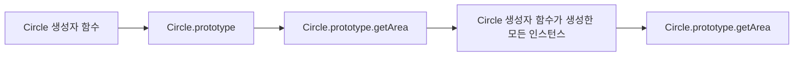
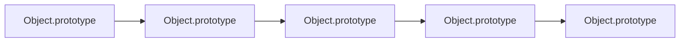

# 19장. 프로토타입(prototype)

JavaScript는 실제로 다중 패러다임 프로그래밍 언어로, 명령형, 함수형, 프로토타입 기반, 객체지향 프로그래밍을 지원합니다.

**[목차]**
19장. 프로토타입(prototype)

- [19장. 프로토타입(prototype)](#19장-프로토타입prototype)
  - [19-1. 객체지향 프로그래밍](#19-1-객체지향-프로그래밍)
  - [19-2. 상속과 프로토타입](#19-2-상속과-프로토타입)
  - [19-3. 프로토타입 객체](#19-3-프로토타입-객체)
    - [19-3-1. `__proto__` 접근자 프로퍼티](#19-3-1-__proto__-접근자-프로퍼티)
    - [19-3-2. 함수 객체의 prototype 프로퍼티](#19-3-2-함수-객체의-prototype-프로퍼티)
    - [19-3-3. 프로토타입의 `constructor` 프로퍼티와 생성자 함수](#19-3-3-프로토타입의-constructor-프로퍼티와-생성자-함수)
  - [19-4. 리터럴 표기법에 의해 생성된 객체의 생성자 함수와 프로토타입](#19-4-리터럴-표기법에-의해-생성된-객체의-생성자-함수와-프로토타입)
  - [19-5. 프로토타입의 생성 시점](#19-5-프로토타입의-생성-시점)
    - [19-5.1 사용자 정의 생성자 함수와 프로토타입 생성 시점](#19-51-사용자-정의-생성자-함수와-프로토타입-생성-시점)
    - [19-5-2. 빌트인 생성자 함수와 프로토타입 생성 시점](#19-5-2-빌트인-생성자-함수와-프로토타입-생성-시점)
  - [19-6. 객체 생성 방식과 프로토타입의 결정](#19-6-객체-생성-방식과-프로토타입의-결정)
    - [19-6-1. 객체 리터럴에 의해 생성된 객체의 프로토타입](#19-6-1-객체-리터럴에-의해-생성된-객체의-프로토타입)
    - [19-6-2. Object 생성자 함수에 의해 생성된 객체의 프로토타입](#19-6-2-object-생성자-함수에-의해-생성된-객체의-프로토타입)
    - [19-6-3. 생성자 함수에 의해 생성된 객체의 프로토타입](#19-6-3-생성자-함수에-의해-생성된-객체의-프로토타입)
  - [19-7. 프로토타입 체인](#19-7-프로토타입-체인)
  - [19-8. 오버라이딩과 프로퍼티 새도잉](#19-8-오버라이딩과-프로퍼티-새도잉)
  - [19-9. 프로토타입의 교체](#19-9-프로토타입의-교체)
  - [19-10. `instanceof` 연산자](#19-10-instanceof-연산자)
  - [19-11. 직접 상속](#19-11-직접-상속)
  - [19-12. 정적 프로퍼티/메서드](#19-12-정적-프로퍼티메서드)
  - [19-13. 프로퍼티 존재 확인](#19-13-프로퍼티-존재-확인)
  - [19-14. 프로퍼티 열거](#19-14-프로퍼티-열거)
  - [참고](#참고)

<br>

## 19-1. 객체지향 프로그래밍

- 객체지향 프로그래밍은 객체의 집합으로 프로그램을 표현하려는 프로그래밍 패러다임입니다.
- 객체지향 프로그래밍은 실세계의 실체를 인식하는 철학적 사고를 프로그래밍에 접목한 개념입니다.
- 객체지향 프로그래밍에서 객체는 상태(state)와 행위(behavior)를 가집니다.
- 객체는 상태를 나타내는 데이터와 상태 데이터를 참조하고 조작할 수 있는 동작(메서드)을 행위로 포함합니다.
- 객체는 상태 데이터와 메서드를 하나의 논리적인 단위로 묶은 복합적인 자료구조입니다.
- 객체는 상태 데이터와 메서드를 캡슐화(encapsulation)합니다.
- 객체의 상태 데이터를 프로퍼티(property), 메서드를 메서드(method)라 부릅니다.

```jsx
// 예제 19-02
// 객체 리터럴
const circle = {
  radius: 5, // 프로퍼티
  // 원의 지름: 2r
  getDiameter() {
    // 메서드
    return 2 * this.radius;
  },
  // 원의 둘레: 2πr
  getPerimeter() {
    // 메서드
    return 2 * Math.PI * this.radius;
  },
  // 원의 넓이: πrr
  getArea() {
    // 메서드
    return Math.PI * this.radius ** 2;
  },
};

console.log(circle);
// {radius: 5, getDiameter: ƒ, getPerimeter: ƒ, getArea: ƒ}

console.log(circle.getDiameter()); // 10
console.log(circle.getPerimeter()); // 31.41592653589793
console.log(circle.getArea()); // 78.53981633974483
```

<br>

## 19-2. 상속과 프로토타입

- 상속은 객체지향 프로그래밍의 핵심 개념입니다.
- 상속은 객체의 프로퍼티 또는 메서드를 다른 객체가 상속받아 그대로 사용할 수 있는 기능입니다.
- 상속을 통해 객체는 다른 객체의 자산을 자신의 것처럼 사용할 수 있습니다.
- 상속을 구현하는 방법은 크게 두 가지가 있습니다.
  - 클래스 상속: 클래스 간의 상속
  - 프로토타입 상속: 객체(인스턴스) 간의 상속

```jsx
// 예제 19-03
// 생성자 함수
function Circle(radius) {
  this.radius = radius;
  this.getArea = function () {
    return Math.PI * this.radius ** 2;
  };
}

// Circle 생성자 함수는 프로토타입을 가지고 있다.
console.log(Circle.prototype.constructor === Circle); // true

// Circle 생성자 함수의 프로토타입은 객체다.
console.log(Circle.prototype); // {constructor: ƒ}

// Circle 생성자 함수의 프로토타입은 Circle 생성자 함수에 의해 생성된 객체의 부모 역할을 하는 객체다.
console.log(Object.getPrototypeOf(new Circle(1))); // {constructor: ƒ}

// Circle 생성자 함수는 자신의 부모 역할을 하는 프로토타입 객체로부터 getArea 메서드를 상속받는다.
console.log(Circle.prototype === Object.getPrototypeOf(new Circle(1))); // true

// Circle 생성자 함수에 의해 생성된 객체는 자신의 프로토타입 객체인 Circle.prototype의 프로퍼티와 메서드를 상속받는다.
const circle = new Circle(1);
console.log(circle.getArea()); // 3.141592653589793
```

- 프로토타입은 언제나 객체입니다.
- 프로토타입은 객체지향 프로그래밍의 상속을 구현하는 매커니즘입니다.
- 프로토타입은 어떤 객체의 상위(부모) 객체의 역할을 하는 객체로서 다른 객체에 공유 프로퍼티(메서드 포함)를 제공합니다.

```jsx
// 예제 19-04
// 생성자 함수
function Circle(radius) {
  this.radius = radius;
}

// Circle 생성자 함수가 생성한 모든 인스턴스가 getArea 메서드를 공유해서 사용할 수 있도록 프로토타입에 추가한다.
// 프로토타입은 Circle 생성자 함수의 prototype 프로퍼티에 바인딩되어 있다.
Circle.prototype.getArea = function () {
  return Math.PI * this.radius ** 2;
};

// 인스턴스 생성
const circle1 = new Circle(1);
const circle2 = new Circle(2);

// Circle 생성자 함수가 생성한 모든 인스턴스는 부모 객체의 역할을 하는 프로토타입 Circle.prototype으로부터 getArea 메서드를 상속받는다.
// 즉, Circle 생성자 함수가 생성하는 모든 인스턴스는 하나의 getArea 메서드를 공유한다.
console.log(circle1.getArea === circle2.getArea); // true

// getArea 메서드를 호출한 circle1 인스턴스는 프로토타입 Circle.prototype의 getArea 메서드를 상속받아 호출한다.
console.log(circle1.getArea()); // 3.141592653589793
```



- 생성자 함수가 생성한 모든 인스턴스는 하나의 프로퍼티나 메서드를 공유합니다.

<br>

## 19-3. 프로토타입 객체

- 프로토 타입 객체는 언제나 일반 객체입니다.
- 모든 객체는 자신의 프로토타입을 가리키는 `[[Prototype]]`이라는 내부 슬롯을 갖습니다.
- `[[Prototype]]` 내부 슬롯의 값은 프로토타입 객체를 가리킵니다.
- `[[Prototype]]` 에 저장된 프로토타입 객체의 프로퍼티나 메서드는 객체가 직접 소유하지 않더라도 객체의 프로퍼티처럼 참조할 수 있습니다.
- `[[Prototype]]` 에 저장된 프로토타입 객체를 **프로토타입**이라고 부릅니다.
- 모든 객체는 하나의 프로토타입을 가집니다.
- 모든 프로토 타입은 생성자 함수와 연결되어 있습니다.
- 모든 객체는 생성자 함수와 연결된 프로토타입을 가리키는 `[[Prototype]]` 내부 슬롯을 갖습니다.

<br>

### 19-3-1. `__proto__` 접근자 프로퍼티

- `[[Prototype]]` 내부 슬롯의 값인 프로토타입 객체는 접근자 프로퍼티인 `__proto__`를 통해 간접적으로 접근할 수 있습니다.
- 접근자 프로퍼티는 자체적으로는 값을 갖지 않고 다른 데이터 프로퍼티의 값을 읽거나 저장할 때 사용하는 접근자 함수로 구성된 프로퍼티입니다.
- `__proto__` 접근자 프로퍼티는 `Object.prototype`의 접근자 프로퍼티 `__proto__`를 상속받아 모든 객체가 사용할 수 있습니다.
- `Object.prototype`: 모든 객체의 최상위 객체입니다.
- `Object.prototype`의 접근자 프로퍼티 `__proto__`는 getter 함수와 setter 함수를 모두 갖고 있습니다.
- `__proto__` 접근자 프로퍼티를 통해 프로토타입에 접근하거나 교체할 수 있습니다.

```jsx
// 19-08
const parent = {};
const child = {};

// child의 프로토타입을 parent로 설정
child.__proto__ = parent;
// parent의 프로토타입을 child로 설정
parent.__proto__ = child; // TypeError: Cyclic __proto__ value
```

- 프로토타입 체인은 단방향 링크드 리스트로 구현되어 있기 때문에 프로토타입 체인에 순환 참조가 발생하는 것을 방지하기 위해 프로토타입은 객체를 가리키는 단방향 링크드 리스트로 구현되어 있습니다.
- 프로토타입 체인에 순환 참조가 발생하면 무한루프에 빠집니다.



- `__proto__` 접근자 프로퍼티 대신 프로토 타입을 교체하는 ECMAScript 6에서 도입된 `Object.setPrototypeOf` 메서드를 사용할 수 있습니다.
- `Object.setPrototypeOf` 메서드는 첫 번째 매개변수에 전달한 객체의 프로토타입을 두 번째 매개변수에 전달한 객체로 교체합니다.

```jsx
// 예제 19-09
// obj는 프로토타입 체인의 종점이다. 즉, 프로토타입이 없다.
const obj = Object.create(null);

// obj는 Object.__proto__를 상속받지 않는다.
console.log(obj.__proto__); // undefined

// __proto__ 접근자 프로퍼티가 없으므로 obj 객체의 프로토타입을 교체할 수 없다.
Object.setPrototypeOf(obj, {}); // TypeError: #<Object> is not extensible

// obj 객체는 프로토타입이 없으므로 Object.getPrototypeOf 메서드를 사용할 수 없다.
console.log(Object.getPrototypeOf(obj)); // TypeError: #<Object> has no prototype
```

```jsx
// 예제 19-10
const obj = {};
const parent = { x: 1 };

// obj 객체의 프로토타입을 취득
console.log(Object.getPrototypeOf(obj)); // Object.prototype

// obj 객체의 프로토타입을 교체
Object.setPrototypeOf(obj, parent); // obj 객체의 프로토타입을 parent 객체로 교체

// obj 객체는 parent 객체를 상속받는다.
console.log(obj.x); // 1
```

- `Object.getPrototypeOf` 메서드는 ES5에서 도입된 메서드이고 IE9 이상에서 사용할 수 있습니다.
- `Object.setPrototypeOf` 메서드는 ES6에서 도입된 메서드입니다.

<br>

### 19-3-2. 함수 객체의 prototype 프로퍼티

- 함수 객체만이 소유하는 prototype 프로퍼티는 함수 객체가 생성자로 사용될 때 이 함수를 통해 생성될 객체의 부모 역할을 하는 객체, 즉 프로토타입 객체를 가리킵니다.

```jsx
// 예제 19-11
// 함수 객체는 prototype 프로퍼티를 소유한다.
(function () {}).hasOwnProperty("prototype"); // true

// 일반 객체는 prototype 프로퍼티를 소유하지 않는다.
({}).hasOwnProperty("prototype"); // false
```

- 함수 객체의 prototype 프로퍼티는 생성자 함수가 생성할 인스턴스의 프로토타입을 가리킵니다.
- 함수 객체의 prototype 프로퍼티는 함수 객체가 생성자로 사용될 때만 의미를 갖습니다.
- non-constructor인 화살표 함수는 prototype 프로퍼티를 소유하지 않습니다.

```jsx
// 예제 19-12
// 화살표 함수는 non-constructor다.
const Person = (name) => {
  this.name = name;
};

// 화살표 함수는 non-constructor이므로 prototype 프로퍼티를 소유하지 않는다.
console.log(Person.hasOwnProperty("prototype")); // false

// 따라서 화살표 함수는 prototype 프로퍼티가 없어 프로토타입을 생성하지도 않는다.
console.log(Person.prototype); // undefined

// ES6의 메서드 축약 표현으로 정의한 메서드는 non-constructor다.
const obj = {
  foo() {},
};

// ES6의 메서드 축약 표현으로 정의한 메서드는 non-constructor이므로 prototype 프로퍼티를 소유하지 않는다.
console.log(obj.foo.hasOwnProperty("prototype")); // false

// 따라서 ES6의 메서드 축약 표현으로 정의한 메서드는 prototype 프로퍼티가 없어 프로토타입을 생성하지도 않는다.
console.log(obj.foo.prototype); // undefined
```

- 생성자 함수로 호출하기 위해 정의하지 않은 일반 함수도 prototype 프로퍼티를 소유합니다. 그러나 객체를 생성하지 않는 일반 함수의 prototype 프로퍼티는 아무런 의미가 없습니다.
- 모든 객체가 가지고 있는 `__proto__` 접근자 프로퍼티와 함수 객체만이 가지고 있는 prototype 프로퍼티는 결국 동일한 프로토타입을 가리킵니다. 하지만 프로퍼티를 소유하는 주체가 다릅니다.

| 구분                        | 소유      | 값              | 사용 주체   | 사용 목적                                     |
| --------------------------- | --------- | --------------- | ----------- | --------------------------------------------- |
| `__proto__` 접근자 프로퍼티 | 모든 객체 | 프로토타입 객체 | 모든 객체   | 프로토타입 체인을 상위로 이동                 |
| prototype 프로퍼티          | 함수 객체 | 프로토타입 객체 | 생성자 함수 | 생성자 함수가 생성할 객체의 프로토타입을 지정 |

```jsx
// 예제 19-13
// 생성자 함수
function Person(name) {
  this.name = name;
}

const me = new Person("Lee");

// Person.prototype과 me.__proto__는 동일한 프로토타입을 가리킨다.
console.log(Person.prototype === me.__proto__); // true
```

<br>

### 19-3-3. 프로토타입의 `constructor` 프로퍼티와 생성자 함수

- 프로토타입의 `constructor` 프로퍼티는 객체의 입장에서 자신을 생성한 객체를 가리키는 프로퍼티입니다.

```jsx
// 예제 19-14
// 생성자 함수
function Person(name) {
  this.name = name;
}

const me = new Person("Lee");

// me 객체의 생성자 함수는 Person이다.
console.log(me.constructor === Person); // true
```

<br>

## 19-4. 리터럴 표기법에 의해 생성된 객체의 생성자 함수와 프로토타입

- 생성자 함수에 의해 생성된 객체는 프로토타입의 `constructor` 프로퍼티가 자신을 생성한 생성자 함수를 가리킵니다.

```jsx
// 예제 19-15
// obj객체를 생성한 생성자 함수는 Object다.
const obj = new Object();
console.log(obj.constructor === Object); // true

// add 함수 객체를 생성한 생성자 함수는 Function이다.
const add = new Function("a", "b", "return a + b");
console.log(add.constructor === Function); // true

// 생성자 함수
function Person(name) {
  this.name = name;
}

// me 객체를 생성한 생성자 함수는 Person이다.
const me = new Person("Lee");
console.log(me.constructor === Person); // true
```

- 리터럴 표기법에 의해 생성된 객체는 프로토타입의 `constructor` 프로퍼티가 자신을 생성한 생성자 함수를 가리키지 않습니다.

```jsx
// 예제 19-16
// 객체 리터럴
const obj = {};

// 함수 리터럴
const add = function (a, b) {
  return a + b;
};

// 배열 리터럴
const arr = [1, 2, 3];

// 정규 표현식 리터럴
const regexp = /is/gi;
```

- 리터럴 표기법에 의해 생성된 객체도 프로토타입이 있습니다. 하지만 리터럴 표기법에 의해 생성된 객체의 경우 프로토 타입의 `constructor` 프로퍼티가 가리키는 생성자 함수가 반드시 객체를 생성한 생성자 함수라고 단정할 수 없습니다.

```jsx
// 예제 19-17
// obj객체는 Object 생성자 함수로 생성한 객체가 아니라 객체 리터럴로 생성한 객체다.
const obj = {};

// 하지만 obj 객체의 생성자 함수는 Object 생성자 함수다.
console.log(obj.constructor === Object); // true
```

- Object 생성자 함수에 인수를 전달하지 않거나 undefined나 null을 인수로 전달하면서 호출하면서 호출하면 Object 생성자 함수는 내부적으로 추상 연산 OrdinaryObjectCreate를 호출하여 빈 객체를 생성합니다.
  - 추상 연산(abstract operation)은 ECMAScript 사양에 등장하는 알고리즘을 의미합니다.
  - 추상 연산은 ECMAScript 사양을 설명하기 위해 사용되는 의사 코드(pseudo code)입니다. 여기서 말하는 의사 코드는 실제로 동작하는 코드가 아니라 ECMAScript 사양을 설명하기 위해 사용되는 코드입니다.
- 이때 생성된 빈 객체의 프로토타입은 Object.prototype입니다.

```jsx
// 예제 19-18
// Object 생성자 함수에 의한 객체 생성
const obj = new Object();
console.log(obj); // {}

// new.target을 사용하면 new 연산자와 함께 생성자 함수로서 호출되었는지 알 수 있다.
function F() {
  if (!new.target) throw "error";
}

// new.target이 undefined나 Object가 아닌 경우
// 인스턴스 -> Foo.prototype -> Object.prototype 순으로 프로토타입 체인이 생성된다.
class Foo extends Object {}
new Foo(); // Foo {}

// 인수가 전달된 경우에는 인수를 객체로 변환한다.
obj = new Object(123);
console.log(obj); // Number {123}

obj = new Object("123");
console.log(obj); // String {123}
```

- 객체 리터럴이 평가될 때는 추상연산 ObjectCreate를 호출하여 빈 객체를 생성하고 프로퍼티를 추가하도록 ECMAScript 사양에 정의되어 있습니다.
- Object 생성자 함수 호출과 객체 리터럴의 평가는 추상 연산 ObjectCreate를 호출하여 빈 객체를 생성하나 new.target의 확인이나 프로퍼티를 추가하는 등 세부적인 처리 과정이 다릅니다. 때문에 Object 생성자 함수에 의해 생성된 객체와 객체 리터럴에 의해 생성된 객체는 프로토타입이 다릅니다.

```jsx
// 예제 19-19
// foo함수는 Function 생성자 함수로 생성한 함수 객체가 아니라 함수 리터럴로 생성한 함수다.
const foo = function () {};

// 하지만 foo 함수 객체의 생성자 함수는 Function 생성자 함수다.
console.log(foo.constructor === Function); // true
```

- 함수 리터럴로 생성한 함수 객체는 함수 객체의 `prototype` 프로퍼티가 가리키는 프로토타입 객체가 Object.prototype이 아닌 Function.prototype입니다.
- 함수 객체의 `prototype` 프로퍼티는 함수 객체가 생성자로 사용될 때 이 함수를 통해 생성될 객체의 부모 역할을 하는 객체, 즉 프로토타입 객체를 가리킵니다.
- 함수 객체의 `prototype` 프로퍼티는 함수 객체가 생성자로 사용될 때만 의미를 갖습니다.
- 프로토타입과 생성자 함수는 단독으로 존재할 수 없습니다. 프로토타입은 언제나 생성자 함수와 쌍으로 존재합니다.
- 함수 객체의 `prototype` 프로퍼티는 함수 객체가 생성자로 사용될 때만 의미를 갖습니다.

| 리터럴 표기법      | 생성자 함수 | 프로토타입         |
| ------------------ | ----------- | ------------------ |
| 객체 리터럴        | Object      | Object.prototype   |
| 함수 리터럴        | Function    | Function.prototype |
| 배열 리터럴        | Array       | Array.prototype    |
| 정규 표현식 리터럴 | RegExp      | RegExp.prototype   |

<br>

## 19-5. 프로토타입의 생성 시점

<br>

### 19-5.1 사용자 정의 생성자 함수와 프로토타입 생성 시점

<br>

### 19-5-2. 빌트인 생성자 함수와 프로토타입 생성 시점

<br>

## 19-6. 객체 생성 방식과 프로토타입의 결정

<br>

### 19-6-1. 객체 리터럴에 의해 생성된 객체의 프로토타입

<br>

### 19-6-2. Object 생성자 함수에 의해 생성된 객체의 프로토타입

<br>

### 19-6-3. 생성자 함수에 의해 생성된 객체의 프로토타입

<br>

## 19-7. 프로토타입 체인

<br>

## 19-8. 오버라이딩과 프로퍼티 새도잉

<br>

## 19-9. 프로토타입의 교체

<br>

## 19-10. `instanceof` 연산자

<br>

## 19-11. 직접 상속

<br>

## 19-12. 정적 프로퍼티/메서드

<br>

## 19-13. 프로퍼티 존재 확인

<br>

## 19-14. 프로퍼티 열거

<br>

## 참고

---

```

```
