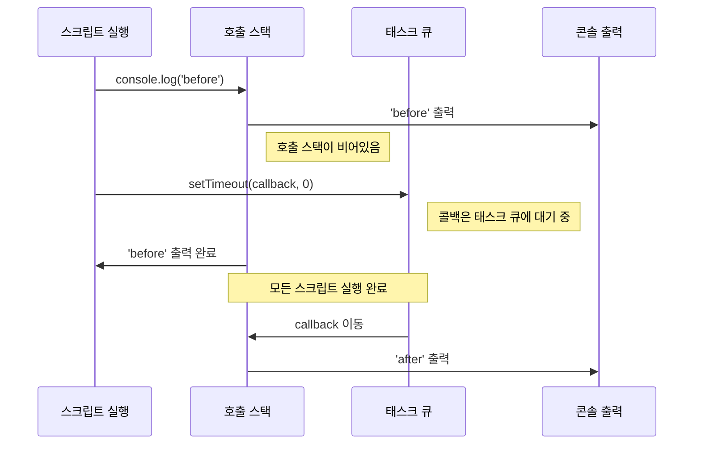

# 41장 타이머

<br>

- [41장 타이머](#41장-타이머)
  - [41-1. 호출 스케줄링(Scheduling a call)](#41-1-호출-스케줄링scheduling-a-call)
  - [타이머 생성 함수](#타이머-생성-함수)
  - [타이머 제거 함수](#타이머-제거-함수)
  - [41-2. 타이머 함수](#41-2-타이머-함수)
  - [41-2-1. `setTimeout` / `clearTimeout`](#41-2-1-settimeout--cleartimeout)
    - [`setTimeout`](#settimeout)
    - [`clearTimeout(timeoutID)`](#cleartimeouttimeoutid)
    - [더 나아가서](#더-나아가서)
    - [`Example`](#example)
  - [41-2-2. `setInterval` / `clearInterval`](#41-2-2-setinterval--clearinterval)
    - [`setInterval`](#setinterval)
    - [`clearInterval(intervalID)`](#clearintervalintervalid)
  - [41-3. 디바운스와 스로틀](#41-3-디바운스와-스로틀)
  - [41-3-1. 디바운스](#41-3-1-디바운스)
  - [41-3-2. 스로틀](#41-3-2-스로틀)
  - [References](#references)

<br>

## 41-1. 호출 스케줄링(Scheduling a call)

<u>호출 스케줄링(Scheduling a call)은 JavaScript에서 특정 함수나 코드 블록을 즉시 실행하지 않고, 지정된 시간이 지난 후에 실행하도록 예약하는 것을 의미합니다.</u>

## 타이머 생성 함수

| 함수 이름     | 설명                                             | 사용 예시                                   |
| ------------- | ------------------------------------------------ | ------------------------------------------- |
| `setTimeout`  | 일정 시간이 지난 후에 함수를 한 번만 실행합니다. | `let timerId = setTimeout(함수, 지연시간);` |
| `setInterval` | 지정된 시간 간격으로 함수를 반복 실행합니다.     | `let intervalId = setInterval(함수, 간격);` |

```jsx
// setTimeout 함수를 사용하여
// 커피 주문 후 일정 시간이 지난 뒤에 커피가 준비되었다는
// 메시지를 출력하도록 스케줄링합니다.
/**
 *
 * @param {string} coffee
 * @param {number} order
 * @param {number} callback
 *
 * @returns {void}
 */
function orderCoffee(coffee, order, callback) {
  setTimeout(callback, order * 1000, coffee);
}

orderCoffee("아메리카노", 3, (coffee) => {
  console.log(`${coffee}가 준비되었습니다!`);
});
```

```jsx
// setInterval 함수를 사용하여
// 1초 간격으로 현재 시각을 출력하도록 스케줄링합니다.
/**
 *
 * @param {number} callback
 *
 * @returns {void}
 */
function showCurrentTime(callback) {
  setInterval(callback, 1000);
}

showCurrentTime(() => {
  const now = new Date();
  console.log(
    `${now.getHours()}시 ${now.getMinutes()}분 ${now.getSeconds()}초`
  );
});
```

## 타이머 제거 함수

| 함수 이름       | 설명                                         | 사용 예시                    |
| --------------- | -------------------------------------------- | ---------------------------- |
| `clearTimeout`  | `setTimeout`으로 설정된 타이머를 제거합니다. | `clearTimeout(timerId);`     |
| `clearInterval` | `setInterval`로 설정된 타이머를 제거합니다.  | `clearInterval(intervalId);` |

```jsx
// setTimeout 함수를 사용하여
// 커피 주문 후 일정 시간이 지난 뒤에 커피가 준비되었다는
// 메시지를 출력하도록 스케줄링합니다.
/**
 *
 * @param {string} coffee
 * @param {number} order
 * @param {number} callback
 *
 * @returns {void}
 */
function orderCoffee(coffee, order, callback) {
  setTimeout(callback, order * 1000, coffee);
}

const coffeeOrder = orderCoffee("아메리카노", 3, (coffee) => {
  console.log(`${coffee}가 준비되었습니다!`);
});

// 커피 주문을 취소합니다.
if (coffeeOrder) {
  clearTimeout(coffeeOrder);
}
```

```jsx
// setInterval 함수를 사용하여
// 1초 간격으로 현재 시각을 출력하도록 스케줄링합니다.
/**
 *
 * @param {number} callback
 *
 * @returns {void}
 */
function showCurrentTime(callback) {
  setInterval(callback, 1000);

  // 10초 후에 showCurrentTime 함수를 중단합니다.
  setTimeout(() => {
    clearInterval(intervalId);
  }, 10000);
}

const intervalId = showCurrentTime(() => {
  const now = new Date();
  console.log(
    `${now.getHours()}시 ${now.getMinutes()}분 ${now.getSeconds()}초`
  );
});
```

<br>

## 41-2. 타이머 함수

자바스크립트에서 타이머 관련 글로벌 함수(전역 함수)는 주로 비동기 작업을 지연 실행하거나 일정한 시간 간격으로 반복 실행하는 데 사용됩니다.

<br>

## 41-2-1. `setTimeout` / `clearTimeout`

### `setTimeout`
`setTimeout` 함수는 <u>지정된 시간이 지난 후에 함수를 한 번 실행합니다.</u>

```jsx
// Syntax
setTimeout(function, delay, [arg1, arg2, ...]);
```
- `function`: 실행할 함수입니다.
- `delay`: 함수가 실행되기까지의 대기 시간으로, 밀리초 단위입니다. *기본값은 0입니다.
- `[arg1, arg2, ...]`: 선택적 매개변수로, 대기 시간이 지난 후 함수에 전달될 인자들입니다. *IE9 이하에선 지원하지 않습니다.

```jsx
setTimeout(function() {
  console.log('3초 후에 실행됩니다.');
}, 3000);
```

### `clearTimeout(timeoutID)`

```jsx
let timeoutID = setTimeout(function() {
  console.log('실행되지 않을 것입니다.');
}, 3000);

clearTimeout(timeoutID); // `setTimeout`에서 반환된 타이머 ID를 인자로 받아 해당 타이머를 취소합니다.
```

### 더 나아가서
**[환경별 `setTimeout` 차이]**

| 환경       | 반환 값      | 타입       | 취소 함수 사용 예제     |
|------------|--------------|------------|------------------------|
| 브라우저   | 타이머 식별자 | `Number`타입     | `clearTimeout(timerId);` |
| Node.js    | 타이머 객체   | 객체 타입     | `clearTimeout(timer);`  |


**브라우저 환경:**
브라우저에서 `setTimeout` 함수를 사용하면, 반환값으로 `Number`타입 타이머 식별자를 받습니다.
이 식별자는 `clearTimeout` 함수를 사용하여 타이머를 취소할 때 필요합니다.

```jsx
// 브라우저 환경
const timerId = setTimeout(() =z> {
  console.log('2초 후에 실행됩니다.');
}, 2000);

// 타이머 취소
clearTimeout(timerId); // timerId는 Number타입입니다.
```

**Node.js 환경:**
`Node.js`에서 `setTimeout`을 사용하면, 반환값으로 타이머 객체를 받습니다.
이 객체를 `clearTimeout` 함수에 전달하여 타이머를 취소할 수 있습니다.

```jsx
// Node.js 환경
const timer = setTimeout(() => {
  console.log('2초 후에 실행됩니다.');
}, 2000);

// 타이머 취소
clearTimeout(timer); // 여기서 `timer`는 객체입니다. 이 객체에는 타이머를 취소하는 데 필요한 정보가 담겨 있습니다.
```

> [브라우저는 HTML5의 timers section을 준수](https://html.spec.whatwg.org/multipage/timers-and-user-prompts.html#timers)

**[지연 시간이 `0ms`일 경우]**

`setTimeout` 함수에 지연 시간을 `0`으로 설정하면,
콜백 함수는 현재 실행 중인 함수가 끝난 직후에 가능한 가장 빠른 시점에 실행됩니다.
이는 JavaScript가 단일 스레드로 동작하기 때문에 가능한 동작입니다.
JavaScript 엔진은 `호출 스택(call stack)`이 비어있을 때만 `태스크 큐(task queue)`에서 대기 중인 태스크를 실행합니다.

```jsx
setTimeout(() => {
  console.log('after');
}, 0);
console.log('before');
```
```jsx
// 출력 결과
before
after
```

이렇게 출력되는 이유는 `setTimeout`이 예약된 콜백 함수를 `태스크 큐`에 넣지만, 현재 실행 중인 코드가 완전히 끝나야만
위 코드에서는 `console.log('before');`가 먼저 실행되어야만 콜백 함수가 `호출 스택`으로 이동하여 실행될 수 있기 때문입니다.

따라서 `0ms`의 지연 시간을 설정한다 하더라도, 현재 실행 중인 코드가 모두 완료된 후에 콜백 함수가 실행됩니다.
이는 `CPU`가 복잡한 작업으로 인해 블로킹되는 것을 방지하고, 무거운 계산 작업을 수행하는 동안 다른 함수의 실행을 허용하여
애플리케이션의 반응성을 향상시키는 데 유용합니다.  

> `setTimeout`의 0ms 지연이 실제로 어떻게 동작하는지를 이해하기 위해 도식화:
> *아래 다이어그램은 JavaScript 엔진이 비동기적 작업을 처리하는 방식을 단순화하여 보여주었지만
> 실제로는 브라우저나 Node.js 환경에 따라 마이크로태스크 큐(microtask queue)와 같은 추가적인 메커니즘이 있을 수 있습니다.



1. 스크립트가 실행되면서 `console.log('before')`가 호출 스택으로 들어갑니다.
2. 'before'가 콘솔에 출력되고 호출 스택에서 제거됩니다.
3. `setTimeout(callback, 0)`가 호출되고, 콜백 함수는 태스크 큐에 들어가 대기합니다.
4. 'before' 출력이 완료되면 호출 스택이 비워집니다.
5. 호출 스택이 비어있으므로 태스크 큐에 있는 콜백 함수가 호출 스택으로 이동합니다.
6. 콜백 함수가 실행되면서 'after'가 콘솔에 출력됩니다.


**[[`setImmediate()`](https://developer.mozilla.org/en-US/docs/Web/API/Window/setImmediate)]**
이 함수는 `Internet Explorer`와 `Edge` 브라우저에서 지원되며 `setTimeout`과 유사한 기능을 하지만, 표준이 아니기 때문에 다른 브라우저에서는 사용할 수 없습니다. 그러나 `Node.js 환경`에서는 `setImmediate()`가 표준 함수로서, `setTimeout(() => {}, 0)`과 유사하게 즉시 실행되어야 할 작업을 큐에 넣어 비동기적으로 처리하는 데 사용할 수 있습니다.


### `Example`
로그인 또는 회원가입 폼에서 사용자가 입력 필드에 내용을 입력할 때 `setTimeout`을 활용하는 경우

```jsx
function validateEmail(email) {
  // 이메일 유효성 검사 로직
  if (/^[^\s@]+@[^\s@]+\.[^\s@]+$/.test(email)) {
    console.log('유효한 이메일 형식입니다.');
  } else {
    console.log('유효하지 않은 이메일 형식입니다.');
  }
}

// 타이머 ID를 저장할 변수
let timeoutId = null;

// input 필드에 keyup 이벤트 리스너를 추가합니다.
document.getElementById('emailInput').addEventListener('keyup', function (e) {
  // 이미 설정된 타이머가 있다면 취소합니다.
  if (timeoutId) {
    clearTimeout(timeoutId);
  }

  // 새로운 타이머를 설정합니다. 사용자가 입력을 멈추고 500ms 후에 validateEmail 함수를 실행합니다.
  timeoutId = setTimeout(() => {
    validateEmail(e.target.value);
  }, 500);
});
```

<br>

## 41-2-2. `setInterval` / `clearInterval`

### `setInterval`
`setInterval`함수는 <u>지정된 시간 간격마다 함수를 반복해서 실행합니다.</u>

```jsx
// Syntax
setInterval(function, interval, [arg1, arg2, ...]);
```
- `function`: 반복해서 실행할 함수입니다.
- `interval`: 함수가 실행될 간격으로, 밀리초 단위입니다.
- `[arg1, arg2, ...]`: 선택적 매개변수로, 각 간격마다 함수에 전달될 인자들입니다.

```jsx
setInterval(function() {
  console.log('2초마다 반복해서 실행됩니다.');
}, 2000);
```

### `clearInterval(intervalID)`

```jsx
let intervalID = setInterval(function() {
  console.log('더 이상 반복해서 실행되지 않습니다.');
}, 2000);

clearInterval(intervalID); // `setInterval`에서 반환된 타이머 ID를 인자로 받아 해당 타이머를 취소합니다.
```

<br>

## 41-3. 디바운스와 스로틀

<br>

## 41-3-1. 디바운스

<br>

## 41-3-2. 스로틀


<br>

## References
- [MDN, setTimeout](https://developer.mozilla.org/en-US/docs/Web/API/setTimeout)
- [MDN, setInterval](https://developer.mozilla.org/en-US/docs/Web/API/setInterval)
- [Modern JavaScript, setTimeout & setInterval](https://ko.javascript.info/settimeout-setinterval)
- [Node.js, Discover JavaScript Timers](https://nodejs.org/en/learn/asynchronous-work/discover-javascript-timers)