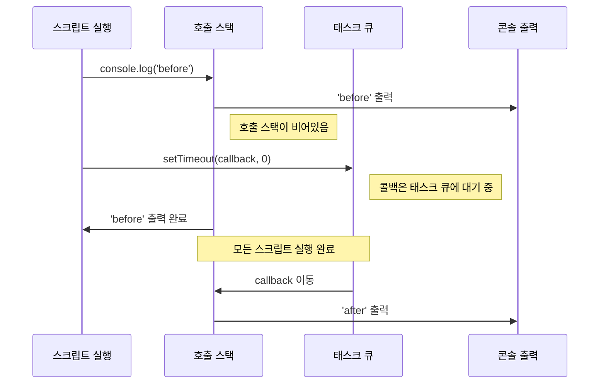
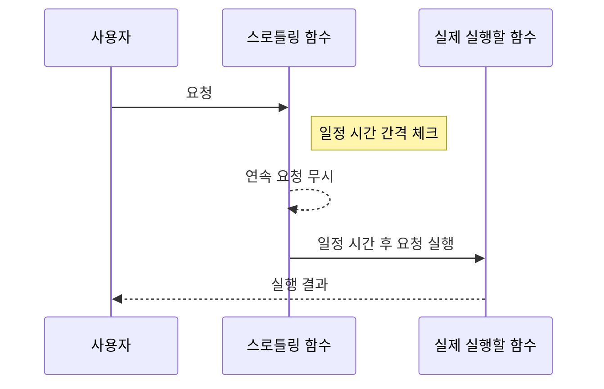

# 41장 타이머

<br>

- [41장 타이머](#41장-타이머)
  - [41-1. 호출 스케줄링(Scheduling a call)](#41-1-호출-스케줄링scheduling-a-call)
  - [타이머 생성 함수](#타이머-생성-함수)
  - [타이머 제거 함수](#타이머-제거-함수)
  - [41-2. 타이머 함수](#41-2-타이머-함수)
    - [41-2-1. `setTimeout` / `clearTimeout`](#41-2-1-settimeout--cleartimeout)
    - [`setTimeout`](#settimeout)
    - [`clearTimeout(timeoutID)`](#cleartimeouttimeoutid)
    - [\[환경별 `setTimeout` 차이\]](#환경별-settimeout-차이)
    - [\[지연 시간이 `0ms`일 경우\]](#지연-시간이-0ms일-경우)
    - [\[`setImmediate()`\]](#setimmediate)
    - [`Example`](#example)
  - [41-2-2. `setInterval` / `clearInterval`](#41-2-2-setinterval--clearinterval)
    - [`setInterval`](#setinterval)
    - [`clearInterval(intervalID)`](#clearintervalintervalid)
    - [`Example`](#example-1)
  - [41-3. `디바운스(Debouncing)`와 `스로틀(Throttling)`](#41-3-디바운스debouncing와-스로틀throttling)
  - [41-3-1. `디바운스(Debouncing)`](#41-3-1-디바운스debouncing)
  - [41-3-2. `스로틀링(Throttling)`](#41-3-2-스로틀링throttling)
    - [`Example`](#example-2)
    - [`Example`](#example-3)
  - [References](#references)
  - [Articles](#articles)

<br>

## 41-1. 호출 스케줄링(Scheduling a call)

<u>호출 스케줄링(Scheduling a call)은 JavaScript에서 특정 함수나 코드 블록을 즉시 실행하지 않고, 지정된 시간이 지난 후에 실행하도록 예약하는 것을 의미합니다.</u>

## 타이머 생성 함수

| 함수 이름     | 설명                                             | 사용 예시                                   |
| ------------- | ------------------------------------------------ | ------------------------------------------- |
| `setTimeout`  | 일정 시간이 지난 후에 함수를 한 번만 실행합니다. | `let timerId = setTimeout(함수, 지연시간);` |
| `setInterval` | 지정된 시간 간격으로 함수를 반복 실행합니다.     | `let intervalId = setInterval(함수, 간격);` |

```jsx
// setTimeout 함수를 사용하여
// 커피 주문 후 일정 시간이 지난 뒤에 커피가 준비되었다는
// 메시지를 출력하도록 스케줄링합니다.
/**
 *
 * @param {string} coffee
 * @param {number} order
 * @param {number} callback
 *
 * @returns {void}
 */
function orderCoffee(coffee, order, callback) {
  setTimeout(callback, order * 1000, coffee);
}

orderCoffee("아메리카노", 3, (coffee) => {
  console.log(`${coffee}가 준비되었습니다!`);
});
```

```jsx
// setInterval 함수를 사용하여
// 1초 간격으로 현재 시각을 출력하도록 스케줄링합니다.
/**
 *
 * @param {number} callback
 *
 * @returns {void}
 */
function showCurrentTime(callback) {
  setInterval(callback, 1000);
}

showCurrentTime(() => {
  const now = new Date();
  console.log(
    `${now.getHours()}시 ${now.getMinutes()}분 ${now.getSeconds()}초`
  );
});
```

## 타이머 제거 함수

| 함수 이름       | 설명                                         | 사용 예시                    |
| --------------- | -------------------------------------------- | ---------------------------- |
| `clearTimeout`  | `setTimeout`으로 설정된 타이머를 제거합니다. | `clearTimeout(timerId);`     |
| `clearInterval` | `setInterval`로 설정된 타이머를 제거합니다.  | `clearInterval(intervalId);` |

```jsx
// setTimeout 함수를 사용하여
// 커피 주문 후 일정 시간이 지난 뒤에 커피가 준비되었다는
// 메시지를 출력하도록 스케줄링합니다.
/**
 *
 * @param {string} coffee
 * @param {number} order
 * @param {number} callback
 *
 * @returns {void}
 */
function orderCoffee(coffee, order, callback) {
  setTimeout(callback, order * 1000, coffee);
}

const coffeeOrder = orderCoffee("아메리카노", 3, (coffee) => {
  console.log(`${coffee}가 준비되었습니다!`);
});

// 커피 주문을 취소합니다.
if (coffeeOrder) {
  clearTimeout(coffeeOrder);
}
```

```jsx
// setInterval 함수를 사용하여
// 1초 간격으로 현재 시각을 출력하도록 스케줄링합니다.
/**
 *
 * @param {number} callback
 *
 * @returns {void}
 */
function showCurrentTime(callback) {
  setInterval(callback, 1000);

  // 10초 후에 showCurrentTime 함수를 중단합니다.
  setTimeout(() => {
    clearInterval(intervalId);
  }, 10000);
}

const intervalId = showCurrentTime(() => {
  const now = new Date();
  console.log(
    `${now.getHours()}시 ${now.getMinutes()}분 ${now.getSeconds()}초`
  );
});
```

<br>

## 41-2. 타이머 함수

자바스크립트에서 타이머 관련 글로벌 함수(전역 함수)는 주로 비동기 작업을 지연 실행하거나 일정한 시간 간격으로 반복 실행하는 데 사용됩니다.

<br>

### 41-2-1. `setTimeout` / `clearTimeout`

### `setTimeout`

`setTimeout` 함수는 <u>지정된 시간이 지난 후에 함수를 한 번 실행합니다.</u>

```jsx
// Syntax
setTimeout(function, delay, [arg1, arg2, ...]);
```

- `function`: 실행할 함수입니다.
- `delay`: 함수가 실행되기까지의 대기 시간으로, 밀리초 단위입니다. \*기본값은 0입니다.
- `[arg1, arg2, ...]`: 선택적 매개변수로, 대기 시간이 지난 후 함수에 전달될 인자들입니다. \*IE9 이하에선 지원하지 않습니다.

```jsx
setTimeout(function () {
  console.log("3초 후에 실행됩니다.");
}, 3000);
```

### `clearTimeout(timeoutID)`

```jsx
let timeoutID = setTimeout(function () {
  console.log("실행되지 않을 것입니다.");
}, 3000);

clearTimeout(timeoutID); // `setTimeout`에서 반환된 타이머 ID를 인자로 받아 해당 타이머를 취소합니다.
```

### [환경별 `setTimeout` 차이]

| 환경     | 반환 값       | 타입         | 취소 함수 사용 예제      |
| -------- | ------------- | ------------ | ------------------------ |
| 브라우저 | 타이머 식별자 | `Number`타입 | `clearTimeout(timerId);` |
| Node.js  | 타이머 객체   | 객체 타입    | `clearTimeout(timer);`   |

**브라우저 환경:**
브라우저에서 `setTimeout` 함수를 사용하면, 반환값으로 `Number`타입 타이머 식별자를 받습니다.
이 식별자는 `clearTimeout` 함수를 사용하여 타이머를 취소할 때 필요합니다.

```jsx
// 브라우저 환경
const timerId = setTimeout(() =z> {
  console.log('2초 후에 실행됩니다.');
}, 2000);

// 타이머 취소
clearTimeout(timerId); // timerId는 Number타입입니다.
```

**Node.js 환경:**
`Node.js`에서 `setTimeout`을 사용하면, 반환값으로 타이머 객체를 받습니다.
이 객체를 `clearTimeout` 함수에 전달하여 타이머를 취소할 수 있습니다.

```jsx
// Node.js 환경
const timer = setTimeout(() => {
  console.log("2초 후에 실행됩니다.");
}, 2000);

// 타이머 취소
clearTimeout(timer); // 기서 `timer`는 객체입니다. 이 객체에는 타이머를 취소하는 데 필요한 정보가 담겨 있습니다.
```

> [브라우저는 HTML5의 timers section을 준수](https://html.spec.whatwg.org/multipage/timers-and-user-prompts.html#timers)

### [지연 시간이 `0ms`일 경우]

`setTimeout` 함수에 지연 시간을 `0`으로 설정하면,
콜백 함수는 현재 실행 중인 함수가 끝난 직후에 가능한 가장 빠른 시점에 실행됩니다.
이는 JavaScript가 단일 스레드로 동작하기 때문에 가능한 동작입니다.
JavaScript 엔진은 `호출 스택(call stack)`이 비어있을 때만 `태스크 큐(task queue)`에서 대기 중인 태스크를 실행합니다.

```jsx
setTimeout(() => {
  console.log("after");
}, 0);
console.log("before");
```

```jsx
// 출력 결과
before;
after;
```

이렇게 출력되는 이유는 `setTimeout`이 예약된 콜백 함수를 `태스크 큐`에 넣지만, 현재 실행 중인 코드가 완전히 끝나야만
(위 코드에서는 `console.log('before');`가 먼저 실행되어야만) 콜백 함수가 `호출 스택`으로 이동하여 실행될 수 있기 때문입니다.

따라서 `0ms`의 지연 시간을 설정한다 하더라도, 현재 실행 중인 코드가 모두 완료된 후에 콜백 함수가 실행됩니다.
이는 `CPU`가 복잡한 작업으로 인해 블로킹되는 것을 방지하고, 무거운 계산 작업을 수행하는 동안 다른 함수의 실행을 허용하여
애플리케이션의 반응성을 향상시키는 데 유용합니다.

> `setTimeout`의 0ms 지연이 실제로 어떻게 동작하는지를 이해하기 위해 도식화:<br> \*아래 다이어그램은 JavaScript 엔진이 비동기적 작업을 처리하는 방식을 단순화하여 보여주었지만
> 실제로는 브라우저나 Node.js 환경에 따라 마이크로태스크 큐(microtask queue)와 같은 추가적인 메커니즘이 있을 수 있습니다.



1. 스크립트가 실행되면서 `console.log('before')`가 호출 스택으로 들어갑니다.
2. 'before'가 콘솔에 출력되고 호출 스택에서 제거됩니다.
3. `setTimeout(callback, 0)`가 호출되고, 콜백 함수는 태스크 큐에 들어가 대기합니다.
4. 'before' 출력이 완료되면 호출 스택이 비워집니다.
5. 호출 스택이 비어있으므로 태스크 큐에 있는 콜백 함수가 호출 스택으로 이동합니다.
6. 콜백 함수가 실행되면서 'after'가 콘솔에 출력됩니다.

### [[`setImmediate()`](https://developer.mozilla.org/en-US/docs/Web/API/Window/setImmediate)]

이 함수는 `Internet Explorer`와 `Edge` 브라우저에서 지원되며 `setTimeout`과 유사한 기능을 하지만, 표준이 아니기 때문에 다른 브라우저에서는 사용할 수 없습니다. 그러나 `Node.js 환경`에서는 `setImmediate()`가 표준 함수로서, `setTimeout(() => {}, 0)`과 유사하게 즉시 실행되어야 할 작업을 큐에 넣어 비동기적으로 처리하는 데 사용할 수 있습니다.

### `Example`

로그인 또는 회원가입 폼에서 사용자가 입력 필드에 내용을 입력할 때 `setTimeout`을 활용하는 경우

```jsx
function validateEmail(email) {
  // 이메일 유효성 검사 로직
  if (/^[^\s@]+@[^\s@]+\.[^\s@]+$/.test(email)) {
    console.log("유효한 이메일 형식입니다.");
  } else {
    console.log("유효하지 않은 이메일 형식입니다.");
  }
}

// 타이머 ID를 저장할 변수
let timeoutId = null;

// input 필드에 keyup 이벤트 리스너를 추가합니다.
document.getElementById("emailInput").addEventListener("keyup", function (e) {
  // 이미 설정된 타이머가 있다면 취소합니다.
  if (timeoutId) {
    clearTimeout(timeoutId);
  }

  // 새로운 타이머를 설정합니다. 사용자가 입력을 멈추고 500ms 후에 validateEmail 함수를 실행합니다.
  timeoutId = setTimeout(() => {
    validateEmail(e.target.value);
  }, 500);
});
```

<br>

## 41-2-2. `setInterval` / `clearInterval`

### `setInterval`

`setInterval()` 함수는 JavaScript에서 주기적으로 특정 작업을 반복하고자 할 때 사용하는 타이머 함수입니다. `setTimeout()`과 비슷하지만, `setTimeout()`은 지정된 시간이 지난 후 콜백 함수를 단 한 번만 실행하는 반면, `setInterval()`은 <u>지정된 시간 간격마다 콜백 함수를 무한히 반복해서 실행합니다.</u>

```jsx
// Syntax
setInterval(function, interval, [arg1, arg2, ...]);
```

- `function`: 반복해서 실행할 함수입니다.
- `interval`: 함수가 실행될 간격으로, 밀리초 단위입니다.
- `[arg1, arg2, ...]`: 선택적 매개변수로, 각 간격마다 함수에 전달될 인자들입니다.

```jsx
setInterval(function () {
  console.log("2초마다 반복해서 실행됩니다.");
}, 2000);
```

### `clearInterval(intervalID)`

타이머를 중지하려면 `clearInterval()` 함수를 사용해야 합니다. `setInterval()` 함수는 타이머 ID를 반환하는데, 이 ID를 `clearInterval()` 함수에 전달하여 타이머를 멈출 수 있습니다.

```jsx
let intervalID = setInterval(function () {
  console.log("더 이상 반복해서 실행되지 않습니다.");
}, 2000);

clearInterval(intervalID); // `setInterval`에서 반환된 타이머 ID를 인자로 받아 해당 타이머를 취소합니다.
```

일반적으로 `setInterval` 콜백 함수 내에서 `clearInterval`을 호출하여 자동으로 다시 실행할지 멈출지를 결정합니다.

```jsx
const interval = setInterval(() => {
  if (App.somethingIWait === "arrived") {
    clearInterval(interval);
  }
  // 그 외의 경우에는 다른 작업을 수행
}, 100);
```

특정 조건이 충족될 때 타이머를 자동으로 중지하려면 `setInterval()` 콜백 함수 내부에서 `clearInterval()`을 호출할 수 있습니다.

```jsx
const interval = setInterval(() => {
  if (App.somethingIWait === "arrived") {
    clearInterval(interval);
  } else {
    // 'arrived'가 아닐 경우 반복해서 실행할 작업들
  }
}, 100);
```

이렇게 `setInterval()`과 `clearInterval()`을 사용하면, 조건에 따라 반복 실행을 관리할 수 있으며, 필요에 따라 타이머를 멈출 수 있습니다.

### `Example`

**[무한 스크롤 구현]**

1. 스크롤 이벤트 감지: `window` 객체의 `scroll` 이벤트를 사용하여 스크롤 위치를 감지합니다.
2. 추가 콘텐트 로드: 스크롤 위치가 특정 임계값에 도달하면, `AJAX` 요청 등을 사용하여 추가 콘텐트를 로드합니다.
3. 스크롤 이벤트 제어: `setInterval`과 `clearInterval`을 사용하여 일정한 간격으로 스크롤 이벤트를 감지하고, 필요한 경우 추가 콘텐트 로드를 실행합니다.

```javascript
// 스크롤 이벤트 제어를 위한 변수
let scrollInterval;

/**
 * 스크롤 이벤트를 처리합니다.
 * 스크롤 위치를 확인하고 추가 콘텐트를 로드하는 로직을 구현합니다.
 */
function handleScroll() {
  // 스크롤 위치가 특정 임계값에 도달하면 추가 콘텐트를 로드합니다.
  if (window.innerHeight + window.scrollY >= document.body.offsetHeight) {
    loadAdditionalContent();
  }
}

/**
 * 추가 콘텐트 로드 로직을 구현합니다.
 * 이 함수는 실제 추가 콘텐트 로드 로직에 맞게 재정의해야 합니다.
 */
function loadAdditionalContent() {
  // 추가 콘텐트 로드 로직 구현
}

/**
 * 무한 스크롤을 시작합니다.
 * 200ms마다 스크롤 이벤트 핸들러를 호출합니다.
 */
function startInfiniteScroll() {
  scrollInterval = setInterval(handleScroll, 200);
}

/**
 * 무한 스크롤을 정지합니다.
 * 스크롤 이벤트 핸들러를 위해 설정된 인터벌을 해제합니다.
 */
function stopInfiniteScroll() {
  clearInterval(scrollInterval);
}

// 무한 스크롤 시작
startInfiniteScroll();
```

> 위 무한 스크롤을 구현하는 예제는 `setInterval` 함수는 지정된 시간 간격마다 특정 코드 또는 함수를 반복해서 실행하는 개념을 이해하기 위한 용도입니다. 무한 스크롤의 경우 사용자가 페이지 끝에 도달하는지를 확인하고, 콘텐트를 불러오기 때문에 `setInterval` 보다는 'scroll' 이벤트 리스너나 'Intersection Observer API'를 사용하는 것이......

<br>

## 41-3. `디바운스(Debouncing)`와 `스로틀(Throttling)`

<br>

## 41-3-1. `디바운스(Debouncing)`

사용자의 입력이나 다양한 이벤트가 발생할 때마다 즉시 처리하면 불필요한 CPU 사이클이나 API 호출, 그리고 성능 저하를 초래할 수 있습니다. 이러한 문제를 해결하기 위해 디바운싱이라는 기술을 사용합니다. 디바운스는 사용자의 연속적인 액션을 일정 시간 동안 그룹화하여 마지막 액션만을 처리하도록 지연시키는 기법입니다. 이를 통해 과도한 처리를 방지하고 효율적인 성능을 유지할 수 있습니다.

```jsx
/**
 * 이메일 형식을 검증하는 함수
 * @param {string} email - 검증할 이메일 주소.
 */
function validateEmail(email) {
  // 이메일 형식 검사
  if (/^[^\\s@]+@[^\\s@]+\\.[^\\s@]+$/.test(email)) {
    console.log("유효한 이메일 형식입니다.");
  } else {
    console.log("유효하지 않은 이메일 형식입니다.");
  }
}

/**
 * 디바운스 함수. 함수의 실행을 지연시키는 역할을 합니다.
 * @param {Function} func - 디바운스를 적용할 함수.
 * @param {number} wait - 지연시킬 시간 (밀리초 단위).
 * @return {Function} - 디바운스가 적용된 함수.
 */
function debounce(func, wait) {
  let timeout;

  return function executedFunction(...args) {
    const later = () => {
      clearTimeout(timeout);
      func(...args);
    };

    clearTimeout(timeout);
    timeout = setTimeout(later, wait);
  };
}

// 디바운싱 적용
// 사용자가 입력을 마치고 500ms 동안 추가 입력이 없을 때 validateEmail 함수를 실행합니다.
const debouncedValidateEmail = debounce(validateEmail, 500);

/**
 * 이메일 입력 필드의 이벤트 리스너
 * 'keyup' 이벤트 발생 시 디바운싱된 검증 함수를 실행합니다.
 */
document.getElementById("emailInput").addEventListener("keyup", function (e) {
  debouncedValidateEmail(e.target.value);
});
```

이렇게 하면 사용자가 타이핑하는 동안에는 유효성 검사를 수행하지 않고, 타이핑을 멈춘 후에만 유효성 검사를 수행하여 불필요한 계산과 리소스 낭비를 줄일 수 있습니다

<br>

## 41-3-2. `스로틀링(Throttling)`

스로틀링(throttling)은 사용자의 연속적인 행동으로 인해 이벤트가 지속적으로 발생할 때 이벤트 핸들러 함수의 실행을 제한하는 기술입니다.

### `Example`


예를 들어, 작은 금붕어를 키우고 있습니다. 이 작은 친구는 먹이를 정말 좋아하죠. 배가 고프면 계속해서 "뽁뽁" 소리를 내며 먹이를 달라고 조릅니다. 하지만 금붕어에게 너무 자주 먹이를 주면 배가 아파할 수 있으므로, 금붕어의 건강을 위해 규칙을 세웠습니다. 어떤 경우에도 24시간 동안은 먹이를 한 번만 주기로요. 금붕어가 아무리 "뽁뽁" 소리를 내도, `스로틀링` 기술을 사용해 마지막으로 먹이를 준 시간부터 24시간이 지나기 전까지는 금붕어의 먹이 요청을 무시합니다. 그렇게 해서 금붕어가 건강하게 자랄 수 있도록 도와주는 것이죠.

```jsx
/**
 * 주어진 함수의 실행을 지정된 한도에 따라 제어하는 스로틀링 함수입니다.
 * @param {Function} func - 스로틀링을 적용할 함수입니다.
 * @param {number} limit - 스로틀링 한도(밀리초 단위)입니다.
 * @returns {Function} 스로틀링이 적용된 함수를 반환합니다.
 */
function throttle(func, limit) {
  let lastCall = 0;
  return function (...args) {
    const now = new Date().getTime();
    if (now - lastCall < limit) {
      return; // 마지막 호출 후 아직 지정된 시간이 경과하지 않았으므로 아무것도 수행하지 않음
    }
    lastCall = now;
    return func(...args); // 지정된 시간이 경과했으므로 함수를 호출함
  };
}

/**
 * 금붕어에게 먹이를 주고, 이 사실을 로그에 남깁니다.
 */
function feedGoldfish() {
  console.log("금붕어 밥줌");
}

/**
 * 하루에 한 번만 금붕어에게 먹이를 주도록 스로틀링을 적용합니다.
 * 위에서 정의한 스로틀 함수를 사용합니다.
 * 24시간 = 86400000밀리초
 */
const throttledFeedGoldfish = throttle(feedGoldfish, 86400000);

/**
 * 금붕어가 먹이를 요청할 때마다 처리할 함수입니다.
 * 스로틀링이 적용된 먹이 주기 함수를 호출합니다.
 */
function requestFood() {
  throttledFeedGoldfish(); // 스로틀링이 적용된 함수를 호출
}

/**
 * 'goldfishButton'에 이벤트 리스너를 추가합니다.
 * 금붕어가 "뽁뽁" 소리를 내며 먹이를 달라고 할 때마다 requestFood 함수를 호출합니다.
 */
document
  .getElementById("goldfishButton")
  .addEventListener("click", requestFood);
```

스로틀링(throttling)은 사용자의 연속적인 행동으로 인해 이벤트가 지속적으로 발생할 때 이벤트 핸들러 함수의 실행을 제한하는 기술입니다.



### `Example`

```javascript
// 스크롤 이벤트가 발생한 횟수를 반환하는 스로틀링 함수
function throttle(func, limit) {
  let lastFunc;
  let lastRan;
  let count = 0; // 이벤트 처리 횟수를 세기 위한 카운터

  return function () {
    const context = this;
    const args = arguments;
    if (!lastRan) {
      func.apply(context, args);
      lastRan = Date.now();
      count++; // 함수가 실행될 때마다 카운터 증가
      console.log(`이벤트 처리 횟수: ${count}`);
    } else {
      clearTimeout(lastFunc);
      lastFunc = setTimeout(function () {
        if (Date.now() - lastRan >= limit) {
          if (lastFunc) {
            func.apply(context, args);
            lastRan = Date.now();
            count++; // 함수가 실행될 때마다 카운터 증가
            console.log(`이벤트 처리 횟수: ${count}`);
          }
        }
      }, limit - (Date.now() - lastRan));
    }
  };
}

// 스크롤 이벤트 핸들러
function handleScroll() {
  console.log("스크롤 이벤트 처리!");
}

// 스로틀링 적용
const throttledScroll = throttle(handleScroll, 1000);

// 이벤트 리스너 등록
window.addEventListener("scroll", throttledScroll);
```

사용자가 스크롤을 할 때마다 throttledScroll 함수가 호출되지만, 실제로 handleScroll 함수는 지정된 시간 간격(예: 1000 밀리초)에 한 번만 실행됩니다.

<br>

## References

- [MDN, setTimeout](https://developer.mozilla.org/en-US/docs/Web/API/setTimeout)
- [MDN, setInterval](https://developer.mozilla.org/en-US/docs/Web/API/setInterval)
- [Modern JavaScript, setTimeout & setInterval](https://ko.javascript.info/settimeout-setinterval)
- [Node.js, Discover JavaScript Timers](https://nodejs.org/en/learn/asynchronous-work/discover-javascript-timers)

## Articles

- [JavaScript Timers: Everything you need to know](https://medium.com/edge-coders/javascript-timers-everything-you-need-to-know-5f31eaa37162)
