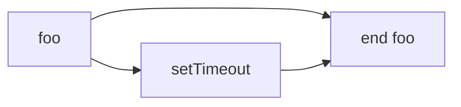
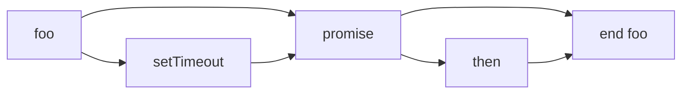
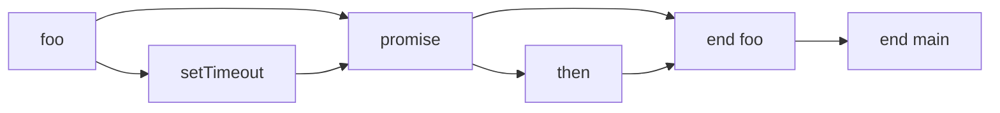
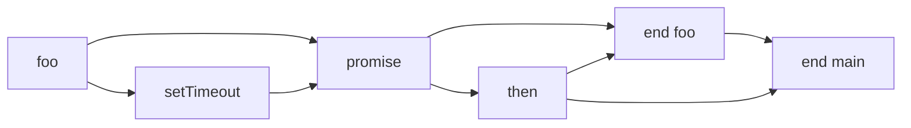

# 42장: 비동기 프로그래밍

<br>

- [42장: 비동기 프로그래밍](#42장-비동기-프로그래밍)
  - [42.1 동기 처리와 비동기 처리](#421-동기-처리와-비동기-처리)
    - [예제: 비동기 처리](#예제-비동기-처리)
  - [42.2 이벤트 루프와 태스크 큐](#422-이벤트-루프와-태스크-큐)
  - [References](#references)

<br>

## 42.1 동기 처리와 비동기 처리

- **스택 자료구조:**

  - LIFO(Last In First Out) 구조
  - 가장 마지막에 추가된 요소가 가장 먼저 제거됨
  - 호출 스택은 스택 자료구조를 사용
  - 호출 스택은 함수 호출을 관리하는 자료구조

- **호출 스택(Call Stack):**

  - 실행 가능한 코드가 실행되기 위해 필요한 환경
  - 실행 가능한 코드가 실행되면 실행 컨텍스트가 생성되고 호출 스택에 푸시됨
  - 실행 컨텍스트는 스코프, 변수, 함수 등의 정보를 담고 있음
  - 실행 컨텍스트는 함수가 실행되는 동안 필요한 정보를 담고 있음
  - 호출 스택은 실행 컨텍스트를 관리하는 자료구조

  ```javascript
  function foo() {
    console.log("foo");
  }

  function bar() {
    console.log("bar");
    foo();
  }

  function baz() {
    console.log("baz");
    bar();
  }

  baz();
  ```

  - 함수 코드 평가 과정:
    - `baz` 함수가 호출 스택에 푸시됨
    - `baz` 함수가 실행되면 `bar` 함수가 호출 스택에 푸시됨
    - `bar` 함수가 실행되면 `foo` 함수가 호출 스택에 푸시됨
    - `foo` 함수가 실행되면 `foo` 함수가 호출 스택에서 팝됨
    - `bar` 함수가 실행되면 `bar` 함수가 호출 스택에서 팝됨
    - `baz` 함수가 실행되면 `baz` 함수가 호출 스택에서 팝됨
    - 호출 스택이 비어있음
    - 호출 스택이 비어있으므로 프로그램이 종료됨

- **실행 컨텍스트(Execution Context; EC):**
  - **특징:**
    - 실행 가능한 코드가 실행되기 위해 필요한 환경
    - 실행 가능한 코드가 실행되면 실행 컨텍스트가 생성되고 호출 스택에 푸시됨
    - 실행 컨텍스트는 스코프, 변수, 함수 등의 정보를 담고 있음
    - 실행 컨텍스트는 함수가 실행되는 동안 필요한 정보를 담고 있음
  - **실행 컨텍스트의 3가지 객체:**
    - **VariableEnvironment(VE):**
      - 현재 실행 컨텍스트의 유효 범위 안에서 선언된 변수와 함수 선언문을 저장
      - 함수 선언문은 함수 객체로 저장
      - 변수와 함수 선언문은 실행 컨텍스트가 생성될 때 저장됨
      - 변수와 함수 선언문은 실행 컨텍스트가 생성될 때 초기화되지 않음
    - **LexicalEnvironment(LE):**
      - 현재 실행 컨텍스트의 유효 범위 안에서 선언된 변수와 함수 선언문을 저장
      - 함수 선언문은 함수 객체로 저장
      - 변수와 함수 선언문은 실행 컨텍스트가 생성될 때 저장됨
      - 변수와 함수 선언문은 실행 컨텍스트가 생성될 때 초기화되지 않음
    - **ThisBinding:**
      - this 키워드가 참조하는 객체를 저장
      - this 키워드가 참조하는 객체는 실행 컨텍스트가 생성될 때 결정됨
  - **실행 컨텍스트의 생성과 실행:**
    - 전역 코드 실행
      - 전역 코드가 실행되면 전역 실행 컨텍스트가 생성되고 호출 스택에 푸시됨
      - 전역 실행 컨텍스트는 전역 코드가 실행되는 동안 유효한 범위를 가짐
      - 전역 실행 컨텍스트는 전역 코드가 실행되는 동안 필요한 정보를 담고 있음
    - 함수 코드 실행
      - 함수 코드가 실행되면 함수 실행 컨텍스트가 생성되고 호출 스택에 푸시됨
      - 함수 실행 컨텍스트는 함수 코드가 실행되는 동안 유효한 범위를 가짐
      - 함수 실행 컨텍스트는 함수 코드가 실행되는 동안 필요한 정보를 담고 있음
    - 실행 컨텍스트의 생성과 실행은 동기 처리 방식으로 이루어짐
      - 동기 처리 방식은 직렬적으로 태스크를 수행
      - 동기 처리 방식은 태스크가 종료될 때까지 태스크들이 대기(블로킹)함

```javascript
// setTimeout 함수와 유사하게 일정 시간이 경과한 이후 콜백함수를 호출하는 sleep 함수
function sleep(callback, delay) {
  const start = new Date().getTime();
  while (new Date().getTime() < start + delay);
  callback();
}

console.log("Start");

// setTimeout 함수와 유사하게 동작
sleep(() => {
  console.log("End");
}, 3000);

console.log("Next Task");
```

- `sleep` 함수는 `setTimeout` 함수와 유사하게 동작
- `sleep` 함수는 일정 시간이 경과한 이후 콜백함수를 호출
- `sleep` 함수는 동기 처리 방식으로 동작
- `sleep` 함수가 실행되면 `while` 문이 실행되고 `while` 문이 종료될 때까지 대기
- `while` 문이 종료되면 콜백함수가 호출됨
- `sleep` 함수가 종료되면 `console.log("Next Task")`가 실행됨

```javascript
//  setTimeout 함수를 이용하여 `sleep` 함수를 수정할 경우
function sleep(callback, delay) {
  setTimeout(callback, delay);
}

console.log("Start");

setTimeout(() => {
  console.log("End");
}, 3000);

console.log("Next Task");
```

- `setTimeout` 함수는 비동기 처리 방식으로 동작하므로 `sleep` 함수가 종료되면 `console.log("Next Task")`가 실행됨
- `setTimeout` 함수는 `sleep` 함수와 유사하게 동작하지만 `setTimeout` 함수는 태스크가 종료될 때까지 대기하지 않고 다음 태스크를 실행하기 때문에 비동기 처리 방식으로 동작한다는 차이점이 있음

**동기 처리와 비동기 처리:**

```javascript
// 동기 처리
function foo() {
  console.log("foo");
  bar();
  console.log("end foo");
}

function bar() {
  console.log("bar");
}

foo();

// 비동기 처리
function foo() {
  console.log("foo");
  setTimeout(function () {
    console.log("end foo");
  }, 0);
  bar();
}

function bar() {
  console.log("bar");
}

foo();
```

|             | 동기 처리                                         | 비동기 처리                                                                        |
| ----------- | ------------------------------------------------- | ---------------------------------------------------------------------------------- |
| 처리 방식   | 직렬적으로 태스크를 수행                          | 병렬적으로 태스크를 수행                                                           |
| 태스크 수행 | 태스크가 종료될 때까지 대기                       | 태스크가 종료될 때까지 대기하지 않고 다음 태스크를 실행                            |
| 태스크 종료 | 태스크가 종료되면 다음 태스크를 순차적으로 실행   | 태스크가 종료되면 콜백 함수 또는 이벤트를 통해 결과를 전달                         |
| 예시        | 동기 I/O, 동기 AJAX                               | 비동기 I/O, 비동기 AJAX, 타이머 함수                                               |
| 장점        | 직렬적으로 태스크를 수행하므로 순서대로 처리 가능 | 병렬적으로 태스크를 수행하므로 빠른 처리 가능                                      |
| 단점        | 태스크가 종료될 때까지 대기하므로 느린 처리 가능  | 태스크가 종료될 때까지 대기하지 않고 다음 태스크를 실행하므로 순서대로 처리 어려움 |

- 동기 처리
  - 직렬적으로 태스크를 수행
  - 태스크가 종료될 때까지 대기
  - 태스크가 종료되면 다음 태스크를 순차적으로 실행
  - 동기 함수는 태스크가 종료될 때까지 대기하기 때문에 순서대로 처리 가능
- 비동기 처리
  - 병렬적으로 태스크를 수행
  - 태스크가 종료될 때까지 대기하지 않고 다음 태스크를 실행
  - 태스크가 종료되면 콜백 함수 또는 이벤트를 통해 결과를 전달
  - 비동기 함수는 태스크가 종료될 때까지 대기하지 않고 다음 태스크를 실행하기 때문에 순서대로 처리하기 어려움
  - 비동기 함수는 전통적으로 콜백 함수를 사용하여 결과를 전달
  - 비동기 처릴르 위한 콜백 패턴은 콜백 지옥을 유발할 수 있음 또 비동기 처리 중 발생한 에러를 캐치하기 어려움
    - 콜백 지옥: 콜백 함수를 중첩하여 사용하면 가독성이 떨어지고 유지보수가 어려워짐
    - 콜백 지옥을 해결하기 위해 프로미스와 async/await 패턴을 사용

<br>

### 예제: [비동기 처리](https://codesandbox.io/p/sandbox/bidonggi-hamsu-43wlxy?file=/src/index.js)

```javascript
/**
 * 지정된 URL에서 포켓몬 데이터를 가져오는 비동기 함수입니다.
 * @param {string} url - 포켓몬 데이터를 요청할 URL입니다.
 * @returns {Promise<Object>} 포켓몬 데이터를 담은 Promise 객체를 반환합니다.
 * @throws {Error} HTTP 요청이 실패하면 에러를 발생시킵니다.
 */
async function fetchPokemonData(url) {
  const response = await fetch(url);
  if (!response.ok) throw new Error(`HTTP error! status: ${response.status}`);
  return await response.json();
}

...

document.addEventListener("DOMContentLoaded", () => {
  populatePokemonList(21);
});

```

- `fetchPokemonData` 함수는 `async` 함수로 정의되어 있으므로 `await` 키워드를 사용하여 비동기 처리를 수행
  - `await` 키워드는 프로미스가 처리될 때까지 대기하고, 프로미스가 처리되면 프로미스가 반환하는 값으로 대체됨
  - `await` 키워드는 `async` 함수 내에서만 사용 가능

## 42.2 이벤트 루프와 태스크 큐

- 자바스크립트 엔진은 단일 호출 스택을 사용
- 호출 스택은 LIFO(Last In First Out) 구조
- 호출 스택이 비어있으면 이벤트 루프가 태스크 큐에서 대기하고 있는 태스크를 호출 스택으로 이동시킴
- 이벤트 루프는 호출 스택이 비어있을 때 태스크 큐에서 대기하고 있는 태스크를 호출 스택으로 이동시킴

```javascript
function foo() {
  console.log("foo");
  setTimeout(function () {
    console.log("setTimeout");
  }, 0);
  console.log("end foo");
}

foo();
```

- `foo` 함수가 호출되면 `setTimeout` 함수가 호출 스택에 들어가지 않고 태스크 큐에 들어감
- `setTimeout` 함수는 0초 뒤에 태스크 큐에 들어감
- `foo` 함수가 종료되면 `setTimeout` 함수가 호출 스택으로 이동됨



- `setTimeout` 함수는 0초 뒤에 태스크 큐에 들어가지만, 실제로는 4ms 뒤에 들어감
- 이유는 브라우저가 4ms 미만의 시간을 지연시키지 않기 때문

```javascript
function foo() {
  console.log("foo");
  setTimeout(function () {
    console.log("setTimeout");
  }, 0);
  new Promise(function (resolve) {
    console.log("promise");
    resolve();
  }).then(function () {
    console.log("then");
  });
  console.log("end foo");
}

foo();
```

- `foo` 함수가 호출되면 `setTimeout` 함수와 `Promise` 함수가 호출 스택에 들어가지 않고 태스크 큐에 들어감
- `setTimeout` 함수는 0초 뒤에 태스크 큐에 들어감
- `Promise` 함수는 `then` 함수가 호출 스택에 들어가지 않고 마이크로태스크 큐에 들어감
- `foo` 함수가 종료되면 `setTimeout` 함수가 호출 스택으로 이동됨
- `setTimeout` 함수가 호출 스택으로 이동되면 `then` 함수가 호출 스택으로 이동됨



- 마이크로태스크 큐는 태스크 큐보다 우선순위가 높음
- 마이크로태스크 큐에 들어간 태스크는 호출 스택이 비어있을 때 바로 호출 스택으로 이동됨
- 태스크 큐에 들어간 태스크는 호출 스택이 비어있을 때 이벤트 루프에 의해 호출 스택으로 이동됨

```javascript
function foo() {
  console.log("foo");
  setTimeout(function () {
    console.log("setTimeout");
  }, 0);
  new Promise(function (resolve) {
    console.log("promise");
    resolve();
  }).then(function () {
    console.log("then");
  });
  console.log("end foo");
}

foo();
console.log("end main");
```

- `foo` 함수가 호출되면 `setTimeout` 함수와 `Promise` 함수가 호출 스택에 들어가지 않고 태스크 큐에 들어감
- `setTimeout` 함수는 0초 뒤에 태스크 큐에 들어감
- `Promise` 함수는 `then` 함수가 호출 스택에 들어가지 않고 마이크로태스크 큐에 들어감
- `foo` 함수가 종료되면 `setTimeout` 함수가 호출 스택으로 이동됨
- `setTimeout` 함수가 호출 스택으로 이동되면 `then` 함수가 호출 스택으로 이동됨
- `then` 함수가 호출 스택으로 이동되면 `end main` 함수가 호출 스택으로 이동됨



- `setTimeout` 함수는 0초 뒤에 태스크 큐에 들어가지만, 실제로는 4ms 뒤에 들어감
- 이유는 브라우저가 4ms 미만의 시간을 지연시키지 않기 때문
- `end main` 함수는 `then` 함수가 호출 스택으로 이동된 후에 호출 스택으로 이동됨
- `then` 함수가 호출 스택으로 이동된 후에 호출 스택이 비어있으므로 마이크로태스크 큐에 들어간 `then` 함수가 호출 스택으로 이동됨
- `then` 함수가 호출 스택으로 이동된 후에 호출 스택이 비어있으므로 태스크 큐에 들어간 `end main` 함수가 호출 스택으로 이동됨



<br>

## References

- [모던 자바스크립트 Deep Dive](http://www.yes24.com/Product/Goods/92742535)
- [MDN web docs - Concurrency model and the event loop](https://developer.mozilla.org/en-US/docs/Web/JavaScript/EventLoop)
