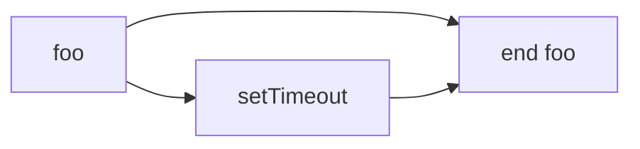
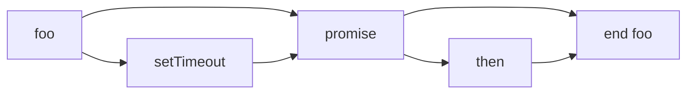
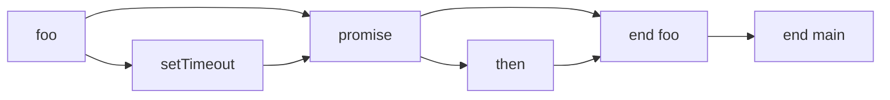
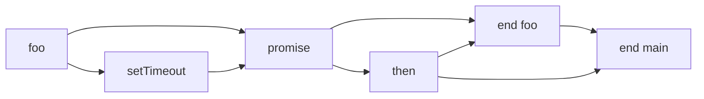

# 42장: 비동기 프로그래밍

<br>

- [42장: 비동기 프로그래밍](#42장-비동기-프로그래밍)
  - [42.1 동기 처리와 비동기 처리](#421-동기-처리와-비동기-처리)
  - [42.2 이벤트 루프와 태스크 큐](#422-이벤트-루프와-태스크-큐)
  - [References](#references)

<br>

## 42.1 동기 처리와 비동기 처리

**스택 자료구조:**


- LIFO(Last In First Out) 구조
- 가장 마지막에 추가된 요소가 가장 먼저 제거됨
- 호출 스택은 스택 자료구조를 사용
- 호출 스택은 함수 호출을 관리하는 자료구조

**동기 처리와 비동기 처리:**

- 동기 처리
  - 직렬적으로 태스크를 수행
  - 태스크가 종료될 때까지 대기
  - 태스크가 종료되면 다음 태스크를 순차적으로 실행
- 비동기 처리
  - 병렬적으로 태스크를 수행
  - 태스크가 종료될 때까지 대기하지 않고 다음 태스크를 실행
  - 태스크가 종료되면 콜백 함수 또는 이벤트를 통해 결과를 전달

```javascript
// 동기 처리
function foo() {
  console.log("foo");
  bar();
  console.log("end foo");
}

function bar() {
  console.log("bar");
}

foo();

// 비동기 처리
function foo() {
  console.log("foo");
  setTimeout(function () {
    console.log("end foo");
  }, 0);
  bar();
}

function bar() {
  console.log("bar");
}

foo();
```

<br>

## 42.2 이벤트 루프와 태스크 큐

- 자바스크립트 엔진은 단일 호출 스택을 사용
- 호출 스택은 LIFO(Last In First Out) 구조
- 호출 스택이 비어있으면 이벤트 루프가 태스크 큐에서 대기하고 있는 태스크를 호출 스택으로 이동시킴
- 이벤트 루프는 호출 스택이 비어있을 때 태스크 큐에서 대기하고 있는 태스크를 호출 스택으로 이동시킴

```javascript
function foo() {
  console.log("foo");
  setTimeout(function () {
    console.log("setTimeout");
  }, 0);
  console.log("end foo");
}

foo();
```

- `foo` 함수가 호출되면 `setTimeout` 함수가 호출 스택에 들어가지 않고 태스크 큐에 들어감
- `setTimeout` 함수는 0초 뒤에 태스크 큐에 들어감
- `foo` 함수가 종료되면 `setTimeout` 함수가 호출 스택으로 이동됨



- `setTimeout` 함수는 0초 뒤에 태스크 큐에 들어가지만, 실제로는 4ms 뒤에 들어감
- 이유는 브라우저가 4ms 미만의 시간을 지연시키지 않기 때문

```javascript
function foo() {
  console.log("foo");
  setTimeout(function () {
    console.log("setTimeout");
  }, 0);
  new Promise(function (resolve) {
    console.log("promise");
    resolve();
  }).then(function () {
    console.log("then");
  });
  console.log("end foo");
}

foo();
```

- `foo` 함수가 호출되면 `setTimeout` 함수와 `Promise` 함수가 호출 스택에 들어가지 않고 태스크 큐에 들어감
- `setTimeout` 함수는 0초 뒤에 태스크 큐에 들어감
- `Promise` 함수는 `then` 함수가 호출 스택에 들어가지 않고 마이크로태스크 큐에 들어감
- `foo` 함수가 종료되면 `setTimeout` 함수가 호출 스택으로 이동됨
- `setTimeout` 함수가 호출 스택으로 이동되면 `then` 함수가 호출 스택으로 이동됨



- 마이크로태스크 큐는 태스크 큐보다 우선순위가 높음
- 마이크로태스크 큐에 들어간 태스크는 호출 스택이 비어있을 때 바로 호출 스택으로 이동됨
- 태스크 큐에 들어간 태스크는 호출 스택이 비어있을 때 이벤트 루프에 의해 호출 스택으로 이동됨

```javascript
function foo() {
  console.log("foo");
  setTimeout(function () {
    console.log("setTimeout");
  }, 0);
  new Promise(function (resolve) {
    console.log("promise");
    resolve();
  }).then(function () {
    console.log("then");
  });
  console.log("end foo");
}

foo();
console.log("end main");
```

- `foo` 함수가 호출되면 `setTimeout` 함수와 `Promise` 함수가 호출 스택에 들어가지 않고 태스크 큐에 들어감
- `setTimeout` 함수는 0초 뒤에 태스크 큐에 들어감
- `Promise` 함수는 `then` 함수가 호출 스택에 들어가지 않고 마이크로태스크 큐에 들어감
- `foo` 함수가 종료되면 `setTimeout` 함수가 호출 스택으로 이동됨
- `setTimeout` 함수가 호출 스택으로 이동되면 `then` 함수가 호출 스택으로 이동됨
- `then` 함수가 호출 스택으로 이동되면 `end main` 함수가 호출 스택으로 이동됨



- `setTimeout` 함수는 0초 뒤에 태스크 큐에 들어가지만, 실제로는 4ms 뒤에 들어감
- 이유는 브라우저가 4ms 미만의 시간을 지연시키지 않기 때문
- `end main` 함수는 `then` 함수가 호출 스택으로 이동된 후에 호출 스택으로 이동됨
- `then` 함수가 호출 스택으로 이동된 후에 호출 스택이 비어있으므로 마이크로태스크 큐에 들어간 `then` 함수가 호출 스택으로 이동됨
- `then` 함수가 호출 스택으로 이동된 후에 호출 스택이 비어있으므로 태스크 큐에 들어간 `end main` 함수가 호출 스택으로 이동됨



<br>

## References

- [모던 자바스크립트 Deep Dive](http://www.yes24.com/Product/Goods/92742535)
- [MDN web docs - Concurrency model and the event loop](https://developer.mozilla.org/en-US/docs/Web/JavaScript/EventLoop)
